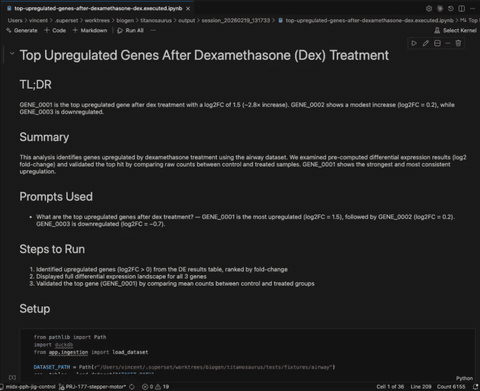

# biosignal

A dataset‑agnostic generative BI app for bioinformatics. Ask a question in plain English, get a clean narrative with tables, charts, and a reproducible notebook.



**What biosignal does**
- Learns your dataset at runtime (no schema setup)
- Turns intent into SQL and visuals
- Writes a story‑driven notebook with explanations
- Exports both `.ipynb` and `.md`

**Why it feels different**
- It doesn’t just answer — it **walks you through what it’s doing**
- The notebook is **the product**: readable, shareable, reproducible

## How It Works
```
User Prompt
   |
   v
LLM Agent
   |  (asks only if needed)
   v
Runtime Profiling + Semantic Sketch
   |
   v
SQL Generation + Execution (DuckDB)
   |
   v
Tables + Charts + Story
   |
   v
Notebook + Markdown Export
```

## Quickstart
```bash
uv sync --dev
biosignal --dataset tests/fixtures/airway --prompt "Give me an overview of the data." --out output/session
```

## Demo Command
```bash
biosignal --mode llm --model eu.anthropic.claude-opus-4-6-v1 \
  --dataset tests/fixtures/airway \
  --prompt "What are the top upregulated genes after dex treatment?" \
  --out output/session
```

## LLM Mode (Claude Opus 4.6)
Set your Anthropic credentials and run with `--mode llm`:
```bash
export ANTHROPIC_API_KEY=...
biosignal --mode llm --model eu.anthropic.claude-opus-4-6-v1 \
  --dataset tests/fixtures/airway \
  --prompt "What are the top upregulated genes after dex treatment?" \
  --out output/session
```

If you use AWS Bedrock, ensure your AWS credentials are configured and keep the default model name.
Set `AWS_REGION` or `AWS_DEFAULT_REGION` as needed for Bedrock access.

## CLI Guide
Basic usage:
```bash
biosignal --dataset <file-or-folder> --prompt "<question>" --out <output-dir>
```

Interactive usage (asks for intent if no prompt provided):
```bash
biosignal --dataset <file-or-folder> --out <output-dir>
```

Multiple prompts (run sequentially):
```bash
biosignal \
  --dataset tests/fixtures/airway \
  --prompt "What are the top upregulated genes after dex treatment?" \
  --prompt "Compare average expression between treated and control samples." \
  --prompt "How many samples are treated vs control?" \
  --prompt "Show counts for gene GENE_0001 across samples." \
  --prompt "Give me an overview of the data." \
  --out output/session
```

Outputs written to `<output-dir>` (names derived from notebook title):
- `<title>.ipynb` (sequential notebook)
- `<title>.executed.ipynb` (papermill‑executed notebook)
- `<title>.md` (markdown export with images)
- `summary.json`
- `tables/table_*.csv`
- `plots/plot_*.png`

Note: each run creates a new timestamped output folder based on `--out`.
The notebook embeds plots directly (no need to re‑run cells to see images).

## Tests
```bash
pytest tests/test_e2e_airway.py
```
