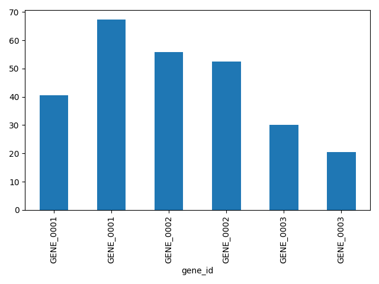
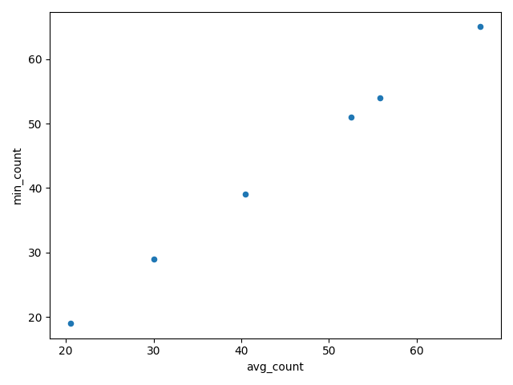

# pogo

pogo is a dataset-agnostic generative BI app for biologists. Ask a question in plain English, get SQL, a table preview, and a chart suggestion, plus a sequential Jupyter notebook that captures the full reasoning trail.

## What You Can Do
- Load CSV, TSV, Excel, or Parquet datasets without schema setup.
- Ask intent-first questions and get explainable answers.
- Export everything to a runnable notebook and Markdown report.

## Quick Start
```bash
pogo --dataset <file-or-folder> --prompt "<question>" --out <output-dir>
```
Note: runs require LLM credentials (Anthropic `ANTHROPIC_API_KEY` or AWS Bedrock credentials + `AWS_REGION`).

## Common Scenarios
- One-shot question: `pogo --dataset data.csv --prompt "Give me an overview" --out output`
- Interactive (asks for intent): `pogo --dataset data.csv --out output`
- Multi-step run: repeat `--prompt` for each question.
- Resume a prior session: `pogo --dataset data.csv --prompt "Next question" --resume output/session_<timestamp>`

## Sample Output
Average gene counts by treatment group (Airway dataset):


Same result as a scatter plot:


## Key Docs
- Introduction (Human): product overview and usage.
- Introduction (Machine): constraints and system contract.
- Plan: architecture and MVP milestones.
- Testing: E2E expectations and the airway harness.
